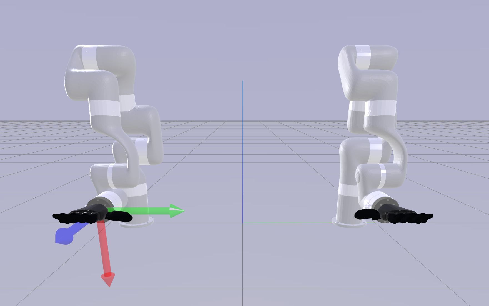
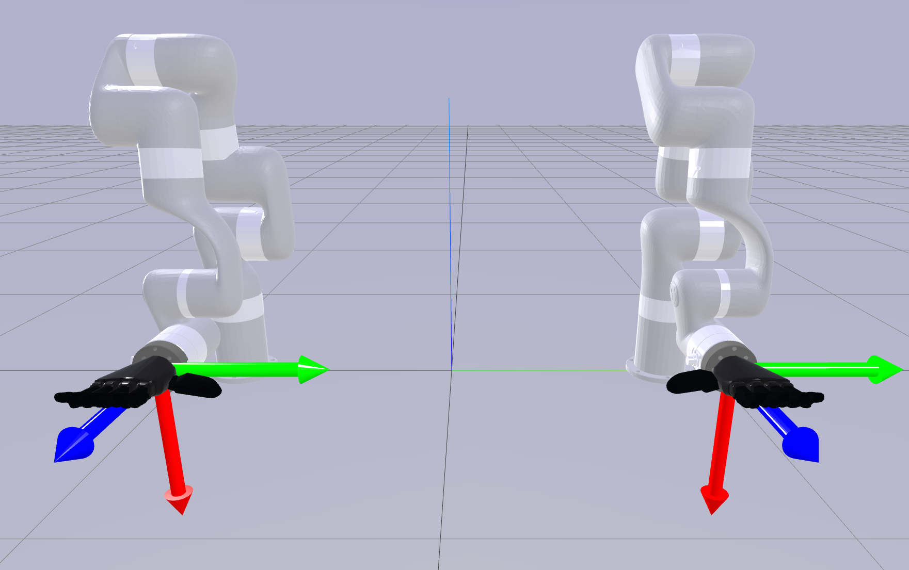

# Visualization Tools

To provide an intuitive user interface of the initialization and teleoperation, a web-based GUI visualizes these
processes in real-time. This feature utilizes the [sim_web_visualizer](https://github.com/NVlabs/sim-web-visualizer).

## 3D Cursor for Initialization

During initialization, a large 3D cursor displayed on the interface becomes increasingly transparent to reflect
progress, transitioning to two smaller 3D gizmos indicating the end effector positions upon completion.

|  |  |  |  |
|:--------------------------------------------:|:----------------------------------------:|:------------------------------------------:|:----------------------------------------:|
|              `ALIGN_CENTER    `              |            `ALIGN_LEFT      `            |             `ALIGN_RIGHT     `             |            `ALIGN_SEPARATELY`            |

## Gizmo for Moving Robot

After initialization, the robot will begin moving inside the web visualizer. The two small gizmo shows the end effector
pose from human.

