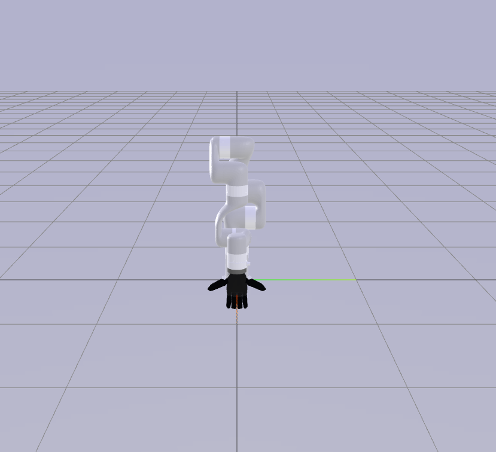
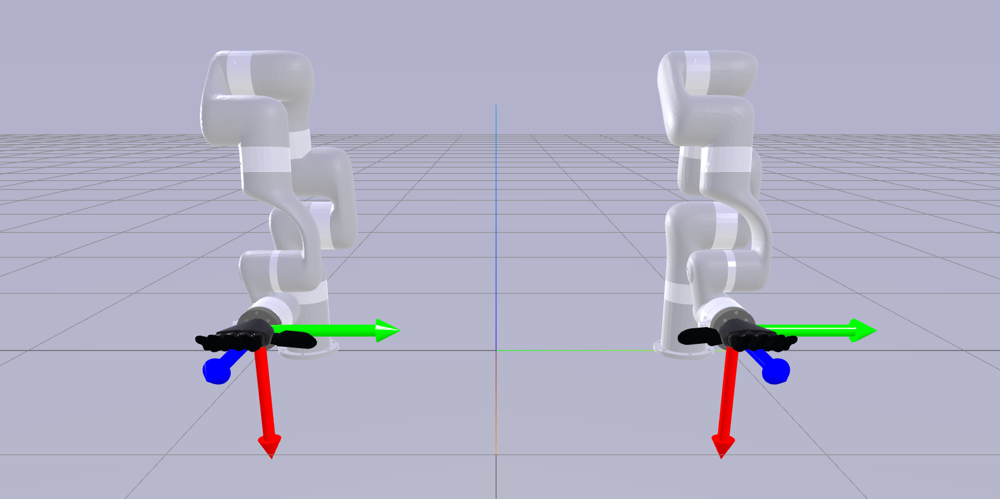

# Basic Usage

This guide covers the setup and operation of the BunnyVisionPro server and client. Although the server and client can be
set up on different machines, for simplicity, this tutorial assumes they are on the same computer.

## Bunny Teleoperation Server Setup

### 1. **Start the Server Docker**

Execute the following command to run the teleoperation server inside a Docker container:

```shell
docker run -it --net host --name bunny_teleop_server yzqin/bunny_teleop_server bash
```

### 2. **Network Configuration**

Ensure that the server, client, and Vision Pro are connected to the same Local Area Network (LAN).

### 3. **Launch Tracking Streamer App**

Open the [Tracking Streamer](https://apps.apple.com/us/app/tracking-streamer/id6478969032) app on your Vision Pro device
and note the IPv4 address shown on the screen.

### 4. **Configure IP in Docker**

Update the `visionpro_config.yml` file inside the Docker container to include the IPv4 address of your Apple Vision Pro:

```yaml
cameras:
  - visionpro:
      avp_ip: <avp_ip>
```

You can edit this file using a terminal-based editor such as `nano`, `vim`, or `emacs` inside docker. For example:

```shell
vim /server/bunny_teleop_server/configs/camera_config/visionpro_config.yml
```

### 5. **Start Server Nodes Inside Docker**

Start the vision node to stream hand pose data from VisionPro:

```shell
run_vision_server -c /server/bunny_teleop_server/configs/camera_config/visionpro_config.yml
```

Then, start the robot node for teleoperation:

```shell
run_robot_server -c /server/bunny_teleop_server/configs/camera_config/visionpro_config.yml -k /server/bunny_teleop_server/configs/kinematics_config/bimanual_xarm7_ability.yml -comm /server/bunny_teleop_server/configs/communication_config/sim_web_visualizer.yml
```

Use two terminal tabs for these servers, which can be managed using `tmux` inside Docker or by opening another terminal
tab with:

```shell
docker exec -it bunny_teleop_server bash
```

### 6. **Web Visualization**

Open a web browser and navigate to [http://127.0.0.1:7000/static/](http://127.0.0.1:7000/static/). You should see the
teleoperation interface with both left and robot arms overlapped at the world origin. This is because the teleop
server will not know the pose of left and right robot base in the world coordinate until the client informs it.

{: style="width:50%"}

!!! tip
    To access the web visualization from a different machine, replace `127.0.0.1` with the IP address of the machine running
    the teleop server.

## Bunny Teleoperation Client Setup

### **Starting the Minimal Teleop Client**

To initiate the teleoperation client, follow these steps:

```shell
git clone https://github.com/Dingry/BunnyVisionPro
cd BunnyVisionPro
python examples/minimal/minimal.py
```

Upon starting the teleop client, it immediately transmits robot information to the server. You should then observe the
initial state on the web visualization interface:



More information about initialization can be found in [Teleoperation Initialization](../advanced/initialization.md)

!!! note
    Once the client is running, if the hand pose is accurately detected, the initialization
    completes quickly, and the robots will begin to mimic your hand movements. You may not have a chance to the see the
    figure above. Don't worry, this indicates that the system is functioning correctly.

Now you can control the virtual robot arms inside the web visualizer with your hand motion.
